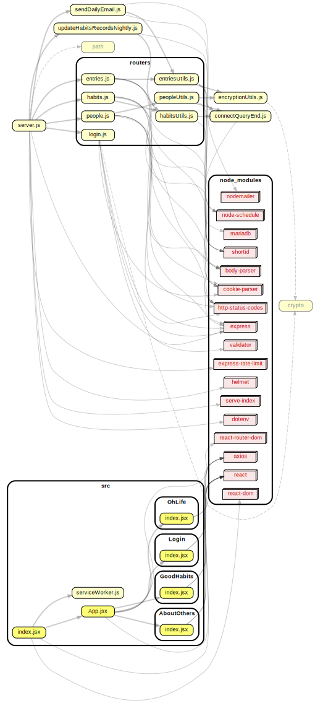

# Grand Central

## Dependency graph



## About Others

### Redux state shape
```
{
  accounts: [
    {
      accountId: 'eWRhpRV',
      people: [
        {
          personId: '23TplPdS',
          name: 'Dale Carnegie',
          notes: 'Remember, today is the tomorrow you worried about yesterday.'
        },
        {
          personId: '46Juzcyx',
          name: 'Alan Dundes',
          notes: 'Light travels faster than sound. This is why some people appear bright until you hear them speak.'
        }
      ]
    },
    {
      accountId: '7oet_d9Z',
      people: [
        {
          personId: 'dogPzIz8',
          name: 'Dalai Lama',
          notes: 'If you think you are too small to make a difference, try sleeping with a mosquito.'
        },
        {
          personId: 'nYrnfYEv',
          name: 'Bill Connolly',
          notes: 'Before you judge a man, walk a mile in his shoes. After that who cares? He\'s a mile away and you\'ve got his shoes!'
        }
      ]
    }
  ]
}
```